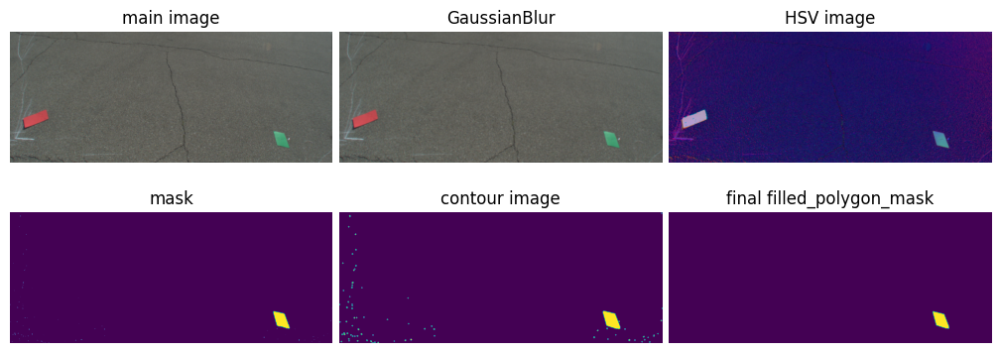
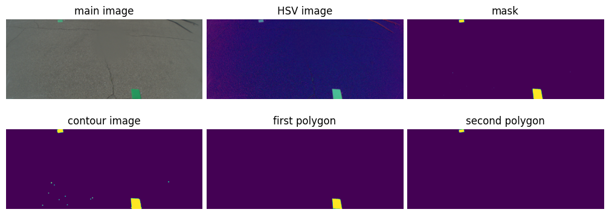
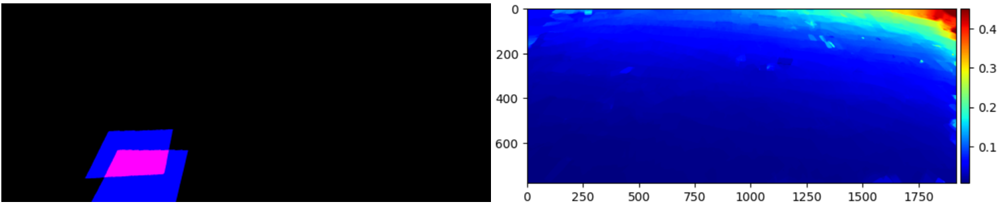
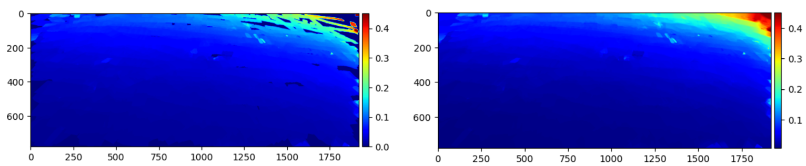

# Camera Calibration Method 1

## Overview
This project provides scripts to aid in the process of calibrating a camera using calibration boards. It primarily focuses on two tasks: 
1. Extracting calibration boards from raw images.
2. Constructing an area map that reflects the area in square inches represented by each pixel.


## Installation

Follow these steps to clone the repo and install the requirements:

1. **Clone the Repository Locally**: Use the following command to clone the repo:
   ```shell
    git clone https://github.com/Younis-Matouq/camera_calibration_method_1.git
    ```

2. **Navigate to the Project Directory**: Install the required Python packages using `pip`:

    ```shell
    cd camera_calibration_method_1
    ```

   ```shell
    pip install -r requirements.txt
    ```

## Scripts

### calibration_boards_extractor
This directory contains two scripts:

1. **extracting_calibration_boards_diff_color.py**
   - Purpose: Extracts calibration boards when they have different colors.
   - 
     

2. **extracting_calibration_boards_similar_color.py**
   - Purpose: Extracts calibration boards when they have the same color.
   - 
     

### Usage
To use these scripts, run the following commands with the specified arguments:

- For different colored boards:
    ```python
    python calibration_boards_extractor/main_map_constructor.py <imgs_directory_path> <save_path> <num_neighbors> <board_area_inches>
    ```
- For similarly colored boards:
    ```python
    python calibration_boards_extractor/extracting_calibration_boards_similar_color.py <imgs_directory_path> <save_path>
    ```


### area_map_constructor
This directory contains the script for generating area maps:

- **main_map_constructor.py**
- Purpose: Generates two area maps - the original and a processed one.
- 
  

#### Usage:
To use the `main_map_constructor` script, execute the following command with the necessary arguments:
```python
python calibration_boards_extractor/main_map_constructor.py <imgs_directory_path> <save_path> <num_neighbors> <board_area_inches>
```

## Output

### Calibration Boards Extractor Scripts
The expected output of using the calibration boards extractor scripts is a binary image containing the mask of the board. The following image illustrates an example of the output:

<p float="left" align="center">
  
</p>

<!--  -->


### Area Constructor Script
The output of running the area constructor script includes two area maps:
1. The original map without any processing.
2. The processed area map using KNN-Regressor to fill gaps within the area map, if presented.

The following image shows the expected output:




## Note
> :information_source:
The scripts currently account for green and red color boards. If other colors are used, modify the `color_range_initiator` function in the `utiles` module to include the upper and lower HSV colors of the used boards.

## License

This project is licensed under the terms of the MIT License.